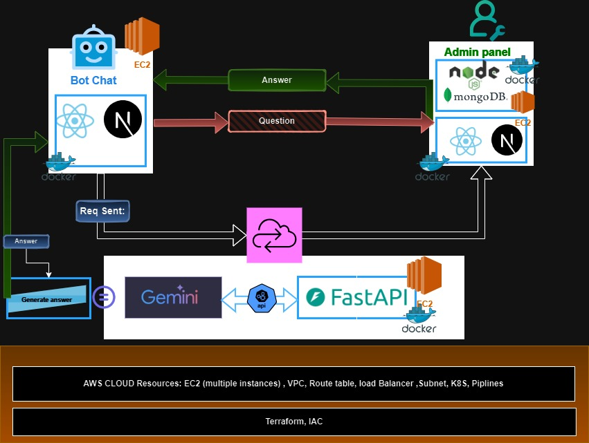

# Algerie Poste Chatbot Hackathon Project



## Overview
This project is part of a **hackathon submission for Algerie Poste**, aimed at creating an intelligent chatbot solution to improve user interaction and automate customer support services. The solution includes a customizable chatbot widget that can be embedded into any web application and an admin interface for managing bot behavior.

### **Status:** 🚧 _Currently in Development_  
While we’ve implemented several key features, the project is still a work in progress. More functionalities and refinements are underway to make the chatbot fully ready for deployment.

---

## Features

### Current Features
- **User Authentication**: Token-based authentication using JWT/API keys for secure access.
- **Chatbot Widget**: A React-based UI for embedding the chatbot on websites.
- **Admin Interface**: A web app for managing chatbot settings and configurations.
- **Dynamic Configuration**: Retrieve and apply user-specific bot settings like themes and greetings.
- **Backend API**: Powered by FastAPI to handle bot configurations and user data securely.

### Upcoming Features
- **Multi-language Support**: Arabic, French, and English for Algerie Poste's diverse user base.
- **Integration with Algerie Poste Systems**: Connect to APIs for postal services, parcel tracking, and account inquiries.
- **Offline Mode**: Enable the chatbot to function with cached data when the internet is unavailable.
- **AI-Powered Responses**: Enhance chatbot intelligence using natural language processing (NLP).
- **Mobile Integration**: Ensure compatibility with mobile apps for seamless user interaction.
- **Analytics Dashboard**: Provide insights into chatbot usage and user interactions.
- **Custom Response Templates**: Allow admins to define quick reply templates for common questions.

---

## Collaborators

The list of team members contributing to this project:
## Collaborators

Here is the list of team members contributing to this project:

| Name                 | Role                           | Responsibilities                                                                                     |
|----------------------|--------------------------------|-----------------------------------------------------------------------------------------------------|
| **Maamar Haddouche** | Team Leader & Cloud Developer  | Designing the platform architecture, overseeing project tasks and timelines, supporting team members with technical issues, implementing FastAPI and API integrations, setting up CI/CD pipelines, and managing cloud infrastructure. |
| **Mohammed Hadbi**   | Frontend Developer             | Crafting the chatbot interface to deliver a seamless and engaging user experience.                  |
| **Rami Alen**        | Backend Developer              | Developing and maintaining the back end and modeling databases, ensuring smooth interaction between the frontend and backend systems. |
| **Ahmed**            | Frontend Engineer              | Designing and implementing an intuitive and functional admin interface for effective management.     |
| **Hadil**             | Frontend Developer             | Creating the chatbot widget using React to ensure easy integration and usability.                   |


---

## Table of Contents
1. [Installation](#installation)
2. [Frontend Integration](#frontend-integration)
3. [Backend API](#backend-api)
4. [User Authentication](#user-authentication)
5. [Bot Configuration](#bot-configuration)
6. [Security](#security)
7. [Example Workflow](#example-workflow)
8. [Contributing](#contributing)
9. [License](#license)

---

## Installation

### Prerequisites
Before running the project, make sure you have the following installed:
- **Node.js** (for frontend React app)
- **Python 3.x** (for backend FastAPI)
- **pip** (for Python package management)

### Backend Setup (FastAPI)
1. Clone the repository:
   ```bash
   git clone https://github.com/your-username/chatbot-integration.git
   cd chatbot-integration/backend
